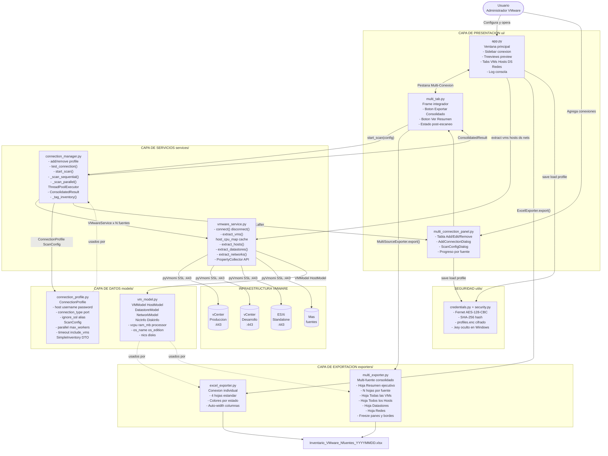
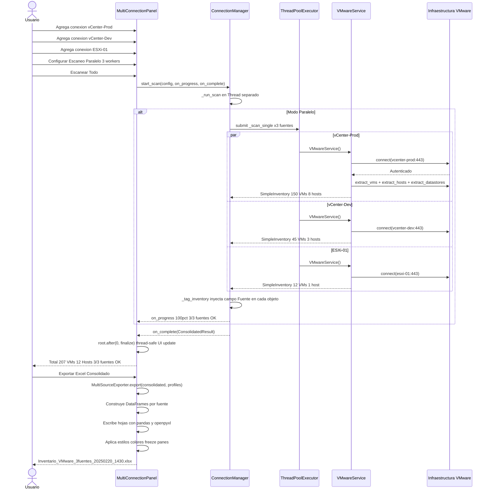
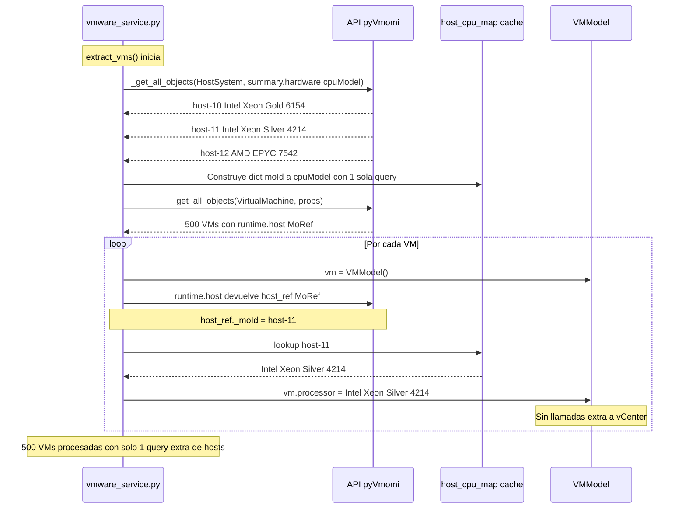

# VMware Inventory System

Aplicacion de escritorio Python para extraccion, visualizacion y exportacion de inventario VMware vCenter/ESXi. Reemplaza scripts PowerShell con una interfaz grafica profesional, soporte multi-conexion y exportacion Excel consolidada.


---

## Tabla de Contenidos

- [Descripcion](#descripcion)
- [Caracteristicas](#caracteristicas)
- [Arquitectura del Sistema](#arquitectura-del-sistema)
- [Flujo de Escaneo Multi-Conexion](#flujo-de-escaneo-multi-conexion)
- [Tecnica de Extraccion del Procesador](#tecnica-de-extraccion-del-procesador)
- [Estructura del Proyecto](#estructura-del-proyecto)
- [Requisitos](#requisitos)
- [Instalacion](#instalacion)
- [Uso](#uso)
- [Modulos Clave](#modulos-clave)
- [Exportacion Excel](#exportacion-excel)
- [Seguridad](#seguridad)
- [Solucion de Problemas](#solucion-de-problemas)

---

## Descripcion

VMware Inventory System es una aplicacion de escritorio **100% Python** que se conecta a entornos VMware (vCenter Server y hosts ESXi standalone) para extraer automaticamente el inventario completo de infraestructura virtual.

**Problema que resuelve:** La gestion manual de inventario VMware mediante scripts PowerShell dispersos, sin interfaz grafica, sin soporte multi-entorno y con exportaciones inconsistentes.

**Solucion:** Una unica aplicacion portable que centraliza conexiones, automatiza la extraccion y genera reportes Excel estructurados con una sola accion.

---

## Caracteristicas

### Conexion
- Soporte para **vCenter Server** y **Hosts ESXi standalone**
- Validacion SSL configurable (produccion/laboratorio)
- **Perfiles de conexion guardados** con cifrado Fernet AES-128
- Prueba de conectividad antes de extraer

### Multi-Conexion
- **Tabla de conexiones** con gestion Add / Edit / Remove
- Escaneo **paralelo o secuencial** configurable por el usuario
- Workers configurables de 1 a 10 conexiones simultaneas
- Barra de progreso individual por fuente en tiempo real

### Extraccion de Inventario
- **Maquinas Virtuales** — 20+ campos incluyendo NICs, discos, SO, estado
- **Hosts ESXi** — hardware, CPU, RAM, version, cluster, numero de serie
- **Datastores** — capacidad, espacio libre/usado, tipo
- **Redes** — tipo Standard/Distributed, VLAN, switch
- Procesador de VM obtenido desde el host fisico padre via cache pre-cargado

### Exportacion Excel
- Exportacion individual por conexion
- Exportacion **consolidada multi-fuente** en un solo archivo `.xlsx`
- Hoja de Resumen ejecutivo con estado de cada fuente
- Una hoja por fuente con todas sus secciones separadas
- 4 hojas consolidadas al final: VMs, Hosts, Datastores, Redes
- Formato profesional con colores por estado de VM y host
- Nombre automatico con timestamp: `Inventario_VMware_3fuentes_20250220_1430.xlsx`

---

## Arquitectura del Sistema



---

## Flujo de Escaneo Multi-Conexion



---

## Tecnica de Extraccion del Procesador

Las VMs en VMware no tienen un campo propio de modelo CPU — heredan el procesador del host fisico donde corren. El sistema resuelve esto con una tecnica de cache pre-cargado que hace una sola query adicional independientemente de cuantas VMs haya.



---

## Estructura del Proyecto

```
vmware_inventory/
│
├── main.py                          # Punto de entrada
│
├── ui/
│   ├── app.py                       # Ventana principal Tkinter + ttkbootstrap
│   ├── multi_connection_panel.py    # Panel gestion multi-conexion y dialogos
│   └── multi_tab.py                 # Frame integrador pestana multi-conexion
│
├── services/
│   ├── vmware_service.py            # Conexion y extraccion VMware via pyVmomi
│   └── connection_manager.py        # Orquestador multi-conexion + ThreadPoolExecutor
│
├── models/
│   ├── vm_model.py                  # Dataclasses VMModel HostModel DatastoreModel etc
│   └── connection_profile.py        # ConnectionProfile ScanConfig enums de estado
│
├── exporters/
│   ├── excel_exporter.py            # Excel para conexion individual
│   └── multi_exporter.py            # Excel consolidado multi-fuente
│
├── utils/
│   ├── credentials.py               # Funciones de gestion de perfiles
│   └── security.py                  # CredentialManager con cifrado Fernet
│
├── setup_multi_connection.py        # Script instalacion integracion automatica
├── build_exe.py                     # Compilacion a exe con PyInstaller
└── requirements.txt
```

---

## Requisitos

| Componente | Version minima |
|---|---|
| Python | 3.12+ |
| pyVmomi | 8.0.0+ |
| ttkbootstrap | 1.10.0+ |
| pandas | 2.0.0+ |
| openpyxl | 3.1.0+ |
| cryptography | 41.0.0+ |

**Sistema Operativo:** Windows 10/11 · Linux Ubuntu 20+ · macOS 12+

---

## Instalacion

```bash
# 1. Clonar
git clone https://github.com/tu-usuario/vmware-inventory-system.git
cd vmware-inventory-system/vmware_inventory

# 2. Entorno virtual
python -m venv venv
venv\Scripts\activate        # Windows
source venv/bin/activate     # Linux/macOS

# 3. Dependencias
pip install -r requirements.txt

# 4. Ejecutar
python main.py
```

### Instalacion automatica del modulo multi-conexion

```bash
# Coloca los archivos nuevos junto a setup_multi_connection.py y ejecuta:
python setup_multi_connection.py
```

El script realiza: validacion de entorno, backup de `app.py`, copia de archivos a sus carpetas, parche del import y la nueva pestana, verificacion de sintaxis de todos los archivos modificados.

---

## Uso

### Conexion Simple

1. Selecciona tipo `vCenter` o `Host ESXi` en el panel izquierdo
2. Ingresa `IP/FQDN`, `Puerto`, `Usuario`, `Contrasena`
3. Activa **Ignorar certificado SSL** si aplica
4. Clic en **Probar Conexion** para verificar
5. Clic en **Extraer Inventario Completo**
6. Clic en **Exportar a Excel**

### Multi-Conexion

1. Ve a la pestana **Multi-Conexion**
2. Usa **Agregar** para registrar cada vCenter/ESXi con sus credenciales
3. Clic en **Configurar Escaneo** para elegir modo, workers y timeout
4. Clic en **Escanear Todo** — progreso en tiempo real por fuente
5. Clic en **Exportar Excel Consolidado**

### Perfiles de Conexion

- Activa **Guardar como** antes de extraer para cifrar y guardar credenciales
- Archivo guardado en: `~/.vmware_inventory/profiles.enc`
- Clave de cifrado en: `~/.vmware_inventory/.key` (oculto en Windows)

---

## Modulos Clave

### `vmware_service.py`

Usa `PropertyCollector` en lugar de traversal recursivo para maxima eficiencia en entornos grandes.

| Metodo | Descripcion |
|---|---|
| `connect()` | Conexion SSL con vCenter o ESXi |
| `extract_vms()` | 500+ VMs con pre-cache de CPU de hosts |
| `extract_hosts()` | Hardware completo de hosts ESXi |
| `extract_datastores()` | Capacidad y uso de datastores |
| `extract_networks()` | Redes Standard y Distributed |

### `connection_manager.py`

Orquestador de escaneo multi-fuente con `ThreadPoolExecutor`. Los callbacks de progreso se envian al hilo UI via `root.after(0, fn)` para thread-safety en Tkinter.

### `multi_exporter.py`

Convierte `ConsolidatedResult` a Excel con pandas y openpyxl. Los row-converters leen atributos reales del modelo (`ram_mb`, `vcpu`, `os_name`) y los mapean a columnas legibles en el Excel.

---

## Exportacion Excel

### Estructura del archivo consolidado

```
Inventario_VMware_3fuentes_20250220_1430.xlsx
│
├── Resumen              Estado de cada fuente con totales consolidados
├── vcenter-prod         Secciones: VMs + Hosts + Datastores + Redes de esa fuente
├── vcenter-dev          Idem por cada fuente escaneada exitosamente
├── esxi-standalone-01   Idem
├── Todas las VMs        Consolidado con columna Fuente que identifica origen
├── Todos los Hosts      Consolidado
├── Datastores           Consolidado
└── Redes                Consolidado
```

### Campos exportados por VM

| Columna Excel | Campo VMModel | Fuente pyVmomi |
|---|---|---|
| Hostname | hostname | name |
| IP | nics[0].ip_addresses | guest.net |
| MAC | nics[0].mac_address | config.hardware.device |
| vCPU | vcpu | config.hardware.numCPU |
| RAM (GB) | ram_mb / 1024 | config.hardware.memoryMB |
| Procesador | processor | host_cpu_map[runtime.host._moId] |
| Sistema Operativo | os_name | guest.guestFullName |
| Edicion SO | os_edition | config.guestFullName |
| Discos | disks[].size_gb | config.hardware.device VirtualDisk |
| Estado | power_state | runtime.powerState normalizado |
| VMware Tools | tools_status | guest.toolsStatus |
| Version HW | hw_version | config.version |
| Fuente | source_name | Inyectado por connection_manager |

### Formato visual

| Hoja | Color header | Colores de filas |
|---|---|---|
| Resumen | Verde oscuro | Verde OK / Rojo error |
| Por fuente | Azul oscuro | Secciones separadas por titulo |
| Todas las VMs | Naranja | Verde encendida / Rojo apagada / Amarillo suspendida |
| Todos los Hosts | Naranja | Azul conectado / Rojo desconectado |
| Datastores / Redes | Naranja | Filas alternadas |

Todas las hojas incluyen paneles congelados, bordes en celdas y columnas con ancho automatico.

---

## Seguridad

Las contrasenas **nunca se guardan en texto plano**.

| Escenario | Mecanismo |
|---|---|
| cryptography instalado | Fernet AES-128-CBC + HMAC-SHA256 |
| Sin cryptography | Base64 — instalar cryptography para produccion |
| Verificacion de contrasena | SHA-256 hash independiente por perfil |

El archivo `.key` se marca como oculto en Windows via `SetFileAttributesW`. En Linux/macOS los permisos son `chmod 600`.

---

## Compilar a ejecutable

```bash
pip install pyinstaller
python build_exe.py
# Resultado: dist/VMwareInventory.exe (portable, sin Python requerido)
```

---

## Solucion de Problemas

**`ImportError: cannot import name 'VMInfo'`**

El archivo `models/__init__.py` tiene nombres incorrectos. Reemplazar con:
```python
from .vm_model import VMModel, HostModel, DatastoreModel, NetworkModel, NicInfo, DiskInfo
```

**`VMwareService.__init__() got an unexpected keyword argument 'host'`**

Las credenciales van en `.connect()`, no en el constructor:
```python
svc = VMwareService()
svc.connect(host=..., user=..., password=..., port=..., ignore_ssl=...)
```

**Procesador vacio en el Excel**

El campo se obtiene via `host_cpu_map`. Verificar que `vmware_service.py` tiene la construccion del cache antes del loop de VMs en `extract_vms()`. El objeto `summary.runtime.host` retorna un MoRef, no el objeto completo — por eso se pre-carga el diccionario separado.

**SSL Error al conectar**

Activar la opcion **Ignorar certificado SSL**. Los entornos de laboratorio usan certificados autofirmados.

**La UI se congela durante la extraccion**

Toda operacion de red debe correr en `threading.Thread(daemon=True)`. Actualizar la UI solo con `root.after(0, callback)`.

---

## Licencia

MIT License — libre para uso personal y comercial.

---

*Python 3.12 · pyVmomi 8.x · ttkbootstrap 1.10 · pandas 2.x · openpyxl 3.1*
